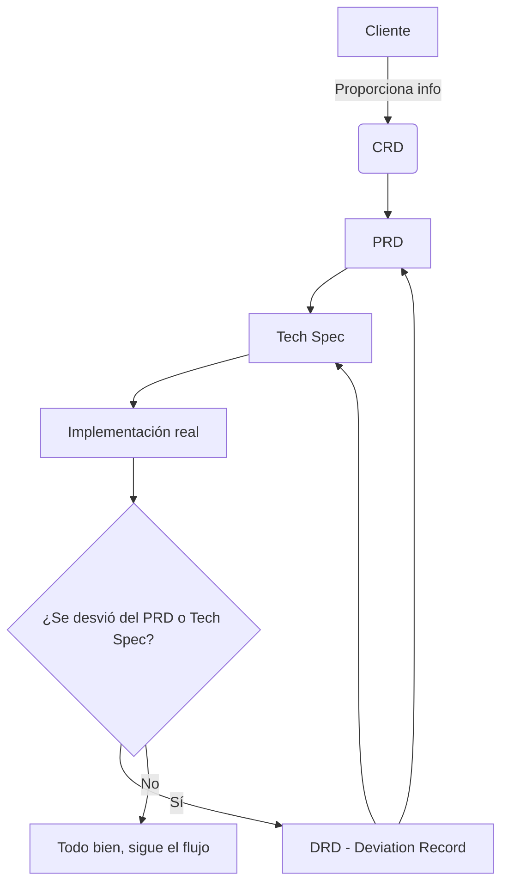
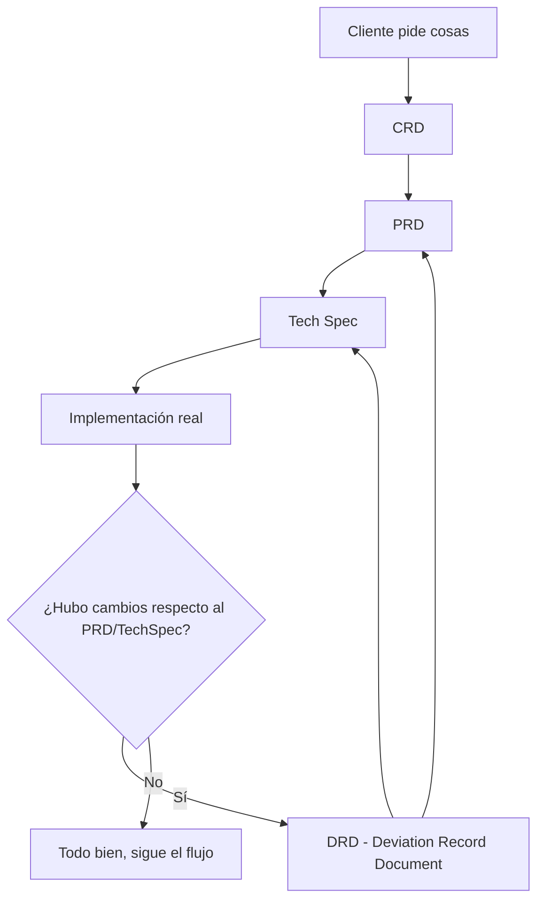

## 📘 Guía de Uso de Plantillas: CRD, PRD, DRD y Tech Spec

Esta guía te ayudará a elegir la plantilla adecuada según el tipo de proyecto o fase en la que estés trabajando, para que comuniques de forma efectiva con clientes, tu equipo, y stakeholders internos.

---

### 🧾 **CRD - Client Requirements Document**

**🧠 ¿Qué es?**

Documento que recopila **todo lo que el cliente espera lograr y todo lo que necesitas del cliente** para poder desarrollar su proyecto correctamente. Desde información técnica hasta contenido de negocio, bases de conocimiento, integraciones, y responsables de comunicación.

**🎯 ¿Cuándo usarlo?**

- Al inicio de cualquier proyecto que requiera insumos del cliente.
- Antes de diseñar, programar o planear una solución.

**📥 ¿Qué incluye típicamente?**

- Datos técnicos (APIs, accesos, endpoints)
- Base de conocimiento (productos, horarios, políticas, etc.)
- Flujos conversacionales (si los tiene)
- Personas clave de contacto
- Anexos útiles

**👤 ¿A quién va dirigido?**

- Cliente final (técnico y no técnico)
- Project managers del cliente
- Equipo de soporte/comercial del cliente

**🛠️ ¿Para qué sirve?**

- Alinear expectativas y responsabilidades
- Evitar retrasos por falta de insumos
- Documentar formalmente qué se pidió y qué se recibió

---

### 📄 **PRD - Product Requirements Document**

**🧠 ¿Qué es?**

Documento interno que define **qué se va a construir** y **por qué**. Describe el problema, la propuesta de solución, el alcance, y cómo se mide el éxito del producto o funcionalidad.

**🎯 ¿Cuándo usarlo?**

- Antes de comenzar a desarrollar una funcionalidad o producto
- Cuando necesitas claridad de negocio y alcance
- Cuando trabajas en equipo y alguien más va a construir o diseñar contigo

**📥 ¿Qué incluye típicamente?**

- Problema a resolver
- Público objetivo
- Solución propuesta
- Alternativas consideradas
- Métricas de éxito
- Alcance (qué entra y qué no)

**👤 ¿A quién va dirigido?**

- Equipo de desarrollo
- Diseño / Producto
- Dirección / Stakeholders

**🛠️ ¿Para qué sirve?**

- Alinear objetivos de negocio y tecnología
- Evitar ambigüedades durante el desarrollo
- Establecer prioridades y límites claros

---

### 🧩 CRD vs PRD: ¿Por qué no es lo mismo?

Aunque el CRD ya documenta todo lo que el cliente quiere y proporciona, **no sustituye al PRD**. Aquí está la clave:

> El **CRD** captura **lo que el cliente quiere**.
> El **PRD** define **lo que realmente se va a construir** y por qué.

El CRD puede contener información de negocio, flujos deseados, accesos, ideas, locuras, caprichos, y expectativas. El PRD es donde aterrizas todo eso con cabeza fría, defines alcance, pones límites y priorizas.

---

### 🎅🏻 Analogía: Carta a Santa Claus vs Realidad

* **El CRD es la carta a Santa Claus**.
  “Quiero un iPhone, una bici y que mi perro hable.”

* **El PRD es lo que puede construir el taller de duendes con presupuesto limitado.**
  “Te damos un Android con cámara, una patineta, y una placa QR para el perro.”

Ambos son necesarios: uno expresa deseos, el otro define compromisos.

---

### 📊 Tabla comparativa: CRD vs PRD

| Concepto             | **CRD**                                          | **PRD**                                           |
| -------------------- | ------------------------------------------------ | ------------------------------------------------- |
| **¿Qué es?**         | Documento de insumos y expectativas del cliente  | Documento que define el producto y su alcance     |
| **¿Quién lo llena?** | Tú, con ayuda del cliente                        | Tú y tu equipo interno                            |
| **¿Para quién es?**  | Cliente, soporte, PMs del cliente                | Producto, desarrollo, dirección                   |
| **¿Qué incluye?**    | Accesos, APIs, flujos, contenido, personas clave | Problema, solución, métricas, alcance, trade-offs |
| **Nivel**            | Información bruta                                | Plan filtrado y accionable                        |
| **Tipo de uso**      | Entrada al proceso                               | Planificación y ejecución                         |

---

### 🧠 **Tech Spec - Technical Specification**

**🧠 ¿Qué es?**

Documento **más técnico**, que explica **cómo** se va a construir lo que el PRD propone. Incluye decisiones técnicas, arquitectura, cambios de base de datos, migraciones, endpoints, etc.

**🎯 ¿Cuándo usarlo?**

- Una vez aprobado el PRD, antes de comenzar a programar
- Cuando hay más de un desarrollador involucrado
- Para definir convenciones y arquitectura del proyecto

**📥 ¿Qué incluye típicamente?**

- Arquitectura propuesta
- Diagramas o flujos
- Librerías o tecnologías a usar
- Plan de implementación por fases
- Flags, migraciones, tests, monitoreo

**👤 ¿A quién va dirigido?**

- Desarrolladores
- Arquitectos de software
- QA / Infraestructura

**🛠️ ¿Para qué sirve?**

- Facilitar la ejecución técnica
- Evitar errores de interpretación entre devs
- Mantener claridad en decisiones técnicas y trade-offs

### 🔧 **DRD - Deviation Record Document**

**🧠 ¿Qué es?**

Es una **bitácora de desviaciones** técnicas o funcionales que se alejan del PRD o Tech Spec original. Sirve para registrar *qué se cambió*, *por qué se cambió*, *cuándo* y *cuál es el impacto*, sin ensuciar los documentos principales.

**🎯 ¿Cuándo usarlo?**

- Cuando lo implementado **no coincide exactamente** con lo que dice el PRD o Tech Spec
- Cuando haces ajustes, workarounds, pruebas técnicas o cambios no planeados
- Antes de actualizar formalmente el PRD o Tech Spec

**📥 ¿Qué incluye típicamente?**

- Fecha del cambio
- Sección afectada del PRD o TechSpec
- Descripción del cambio
- Razón / limitación técnica / feedback de cliente
- Impacto funcional o técnico
- Estado: Pendiente / Validado / Promovido / Rechazado
- Owner (quién lo documentó) y VoBo

**👤 ¿A quién va dirigido?**

- Tú mismo (como dev o arquitecto)
- Tu jefe directo o líder técnico
- QA, Producto o cualquier persona que revise entregables vs. lo que se pidió

**🛠️ ¿Para qué sirve?**

- Trazabilidad técnica
- Evitar ambigüedades entre “lo que se pidió” vs “lo que se construyó”
- Controlar cuándo se debe actualizar el PRD o TechSpec
- Tener un registro claro y profesional de cambios no planeados

---

## 🔁 **Relación entre los documentos**

---

## 🧭 ¿Qué plantilla usar?

| Fase del Proyecto | ¿Qué plantilla usar? | Responsable principal |
| --- | --- | --- |
| Inicio con cliente | ✅ CRD | Tú (como proveedor) |
| Planeación funcional | ✅ PRD | Tú + Dirección |
| Diseño técnico | ✅ Tech Spec | Tú o dev principal |
| Ejecución | PRD + Tech Spec | Todo el equipo |
| Cambios inesperados | ✅ DRD | Tú (dev responsable) |

---

¿Quieres que te lo entregue en formato Markdown con íconos o versión copiable para Notion? También puedo incluir un botón tipo Notion Template si usas alguna base.

## 🧠 ¿Qué pasa si me desvío del PRD

Si por restricciones técnicas tu implementación no es *idéntica* al PRD, pero mantiene el espíritu funcional, no lo ocultes ni lo metas todo al PRD como si nada. Usa el siguiente flujo:

Este segundo diagrama muestra cómo manejar cambios sin ensuciar tu PRD con hacks o desviaciones.